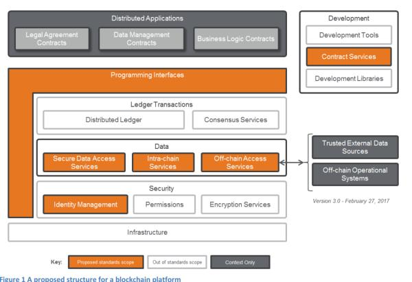
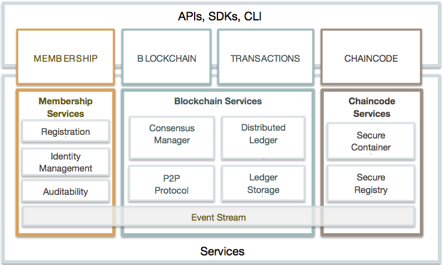

# 区块链与超级账本

区块链企业账本是通过使用区块链技术中的超级账本技术完成的一套企业交易数据存储体系。区块链技术也被称之为分布式账本技术，是一种互联网数据库技术，其特点是去中心化、公开透明，让每个人均可参与数据库记录。而企业账本采用联盟链的方式，参与记账的用户都需要通过企业进行认证，才能进入区块链网络进行交易记账。

## 概述

企业分布式账本采用区块链网络分布式账本技术。区块链网络是一个去中心化的网络，分布式账本技术，有效减少数据丢失风险。通过多方组织对账本记录背书认证，可证明账本记录的真实性，配合密钥加密、多通道控制访问及区块链不可篡改的特性，为企业资产的隐私、公证、融资提供有力的证明。

区块链就是一种去中心化的分布式账本数据库。去中心化，即与传统中心化的方式不同，这里是没有中心，或者说人人都是中心；分布式账本数据 库，意味着记载方式不只是将账本数据存储在每个节点，而且每个节点会同步共享复制整个账本的数据。同时，区块链还具有去中介化、信息透明等特点。 

## 区块链的概念

区块链（`Blockchain`）是由节点参与的分布式数据库系统，它的特点是不可更改，不可伪造，也可以将其理解为账簿系统(`ledger`)。它是比特币的一个重要概念，完整比特币区块链的副本，记录了其代币（`token`）的每一笔交易。通过这些信息，我们可以找到每一个地址，在历史上任何一点所拥有的价值。

区块链是由一串使用密码学方法产生的**数据块**组成的，每一个区块都包含了上一个区块的哈希值（`hash`），从创始区块（`genesis block`）开始连接到当前区块，形成块链。每一个区块都确保按照时间顺序在上一个区块之后产生，否则前一个区块的哈希值是未知的。这些特征使得比特币的双花（`double-spending`）非常困难。区块链是比特币的核心技术。

区块链运行的程序称为链码(`chaincode`)，保存状态(`state`)和账本数据(`ledger data`)、执行交易(`transaction`)。链码是核心要素，交易操作在链码上调用。交易必须被**背书**(`endored`)，只有经过背书的交易才可以提交，并对状态产生影响。有可能存在一个或多个特定的链码用于管理功能和参数，统称为**系统链码**。

区块链概念的出现，首先是在**中本聪**的比特币白皮书中提到的，但是以**工作量证明链**（`proof-of-work chain`）的形式而存在，以下是中本聪对区块链概念的描述：

**时间戳服务器**通过对以区块(`block`)形式存在的一组数据，实施**随机散列**而加上时间戳，并将该随机散列进行**广播**，就像在新闻或世界性新闻组网络（`Usenet`）的发帖一样 。显然，该时间戳能够证实特定数据必然于某特定时间是的确存在的，因为只有在该时刻存在了才能获取相应的随机散列值。每个时间戳应当将前一个时间戳纳入其随机散列值中，每一个随后的时间戳都对之前的一个时间戳进行增强(`reinforcing`)，这样就形成了一条链（`Chain`）。

节点始终都将**最长**的链视为正确链，并持续工作和延长它。如果有两个节点同时广播不同版本的新区块，那么其他节点在接收到该区块的时间上，将存在先后差别。当此情形，他们将在**率先收到**的区块基础上进行工作，但也会保留另外一条链，以防后者变成最长链。该僵局（tie）的打破，要等到下一个工作量证明被发现，而其中的一条链被证实为是较长的一条，那么在另一条分支链上工作的节点将**转换**阵营，开始在较长的链上工作。

区块链上的数据存储功能依赖于与**区块链的确认**，一次有效检验称为一次确认。通常一次数据的存储要获得数个确认才能进行。

区块链技术是众多加密数字货币的核心，包括比特币、以太坊、莱特币等。维护区块链的方式，有工作量证明（`proof-of-work`）、权益证明(`proof-of-stake`)等。

## 区块链的特征

- **分布式存储**：整个区块链网络中参与的节点都可以进行数据储存。
- **点对点传输**：数据记录选择就近性能网络较好的机器进行数据存储，进行点对点传输。待数据传输完成并且达成共识后进行全网广播同步数据。
- **共识机制**：是区块链系统中实现不同节点之间建立信任、获取权益的数学算法。任何人都可以参与到区块链网络，每一台设备都能作为一个节点，每个节点都允许获得一份完整的数据库拷贝。节点间基于一套共识机制，通过竞争计算共同维护整个区块链。任一节点失效，其余节点仍能正常工作。 
- **数据加密**：用户数据可以加密，数据被公开也无法识别该数据属于哪个用户。
- **去中心化**：区块链由众多节点共同组成一个端到端的网络，不存在中心化的设备和管理机构。 没有第三方中介，一切都由参与节点上的程序来完成 。
- **公开透明**：数据对全网节点公开透明，可以选择通过加密算法对数据进行加密后公开，保证数据安全性。
- **用户匿名**：由于节点与节点之间是去信任的，因此节点之间无需公开身份，每个参与的节点都是匿名的。 
- **可追溯**：区块链中的每一笔交易都通过密码学方法与相邻两个区块串联，因此可以追溯到任何一笔交易的前世今生。
- **安全性**：主要体现在分布式和多点共识，即使一个节点被攻击或宕机也不会影响网络的运行。 
- **不可篡改性**：主要体现在分布式和共识机制上，单个甚至多个节点对数据库的修改无法影响其他节点的数据库，除非能控制整个网络中超过51%的节点同时修改，这几乎不可能发生。
- **去信任**：节点之间数据交换通过数字签名技术进行验证，无需互相信任，只要按照系统既定的规则进行，节点之间不能也无法欺骗其它节点。

## 区块链的优点

**去中心化**：区块链存储数据时使用的是对等网络技术，使用分布式计算和存储，不存在中心化的硬件或管理机构。所有节点的权利和义务都相等，因此任一节点停止工作都会不影响系统整体的运作。

**集体维护**：系统是开放的，除了交易各方的私有信息被加密外，系统是由其中所有具有维护功能的节点共同维护的，任何人都可以通过公开的接口查询区块链数据和开发相关应用，因此整个系统信息高度透明。

**信息不可篡改**：一旦信息经过验证并添加至区块链，就会永久的存储起来。生成一套按照时间先后顺序记录的、不可篡改的、可信任的数据库，从而可以限制相关不法行为。因此区块链的数据稳定性和可靠性极高。

**无须信任系统**：由于节点之间的交换遵循固定的算法，参与人不需要对任何人信任，随着参与节点增加，系统的安全性反而增加。因此交易对手无须通过公开身份的方式让对方自己产生信任，对信用的累积非常有帮助。

**安全性问题**：区块链技术一大特点就是不可逆、不可伪造、使用密码学加密算法进行数据加密，但前提是私钥是安全的。私钥是用户生成并保管的，没有第三方参与。私钥一旦丢失，便无法对账户的资产做任何操作。

## 区块链的分类

### 公链（`public blockchain`）

公链，是指全世界任何人都可读取、发送交易且能获得有效确认的共识区块链。公链的安全由工作量证明机制（`pow`）或权益证明机制(`pos`)等方式负责维护。它们是以**经济奖励**与**加密数字验证**相结合的方式而存在的，并遵循着一般原则：每个人从中可获得的经济奖励，与对共识过程作出的贡献成正比。这些区块链通常被认为是**完全去中心化**的。

### 联盟链：（`consortium blockchains`）

联盟连又称为共同体区块链，是指其共识过程受到**预选**节点控制的区块链。例如，有15个金融机构组成一个共同体，每个机构都运行着一个节点，而且为了使每个区块生效需要获得其中10个机构的确认。区块链或许允许每个人都可读取，或者只受限于参与者，或走混合型的路线，例如区块的根哈希及其API（应用程序接口）对外公开，API可允许外界用来作有限次数的查询和获取区块链状态的信息。这些区块链可视为**部分去中心化**。

### 私链（`private blockchain`)

完全私有的区块链 , 又称无代币区块链（`Token-less blockchain`），是指其写入权限仅在一个组织手里的区块链。读取权限或者对外开放，或者被任意程度地进行了限制。相关的应用囊括数据库管理、审计、甚至一个公司，但在很多的情形下，公共的可读性并非是必须的。

关于没有原生代币的系统，是否能被称为区块链，仍然有着很大的争议。一些人认为，没有代币的区块链，可以一种分布式多版本并发控制(`MVCC`)数据库的形式而存在。多版本并发控制，可防止两笔交易在数据库中修改一个单一列，而区块链，则是阻止两笔交易在区块链中的单个输出。

## 公链和私链的特点

联盟区块链结合了公链的**低信任**和私链的**单一高度信任**， 提供了一种混合的模式，而私链可以更精确地描述为带有一定程度数字加密功能，可管理（`permissioned`）的传统中心化系统。

**公链特点：**

+ 中立、开放、去中心化
+ 不可更改，不可撤销
+ 拥有网络效应
+ 抗审查性高

**私链特点：**

+ 规则易于修改（交易，余额等）
+ 交易成本低（交易只需几个受信节点验证即可）
+ 读取权限受限

## 区块链的技术优势

区块链体系结构的核心优势包括：

+ 任何节点都可以创建交易，在经过一段时间的确认之后，就可以合理地确认该交易是否为有效，区块链可有效地防止双花问题的发生。

+ 对于试图重写或者修改交易记录而言，它的成本是非常高的。因为至少需要篡改区块链网络中51%的节点数据。

+ 区块链实现了两种记录：交易（`transactions`）以及区块（`blocks`）。

  交易是被存储在区块链上的实际数据，而区块则是记录确认某些交易是在何时、以及以何种顺序成为区块链数据库的一部分。

  交易是由参与者在正常过程中使用系统所创建的，而区块则是由我们称之为矿工（`miners`）的单位负责创建。

## 区块链工作原理

如果把区块链作为一个状态机，则每次交易就是试图改变一次状态，而每次共识生成的区块，就是参与者对于区块中所有交易内容导致状态改变的结果进行确认。

基本概念包括：

- **交易（`Transaction`）**：一次操作，导致账本状态的一次改变，如添加一条记录
- **区块（`Block`）**：记录一段时间内发生的交易和状态结果，是对当前账本状态的一次共识
- **链（`Chain`）**：由一个个区块按照发生顺序串联而成，是整个状态变化的日志记录

### 什么是区块

区块是区块链上的一个组成部分，区块链有N个区块组成。区块是记录一段时间内发生的交易和状态结果，是对当前账本状态的一次共识。数据通过区块(`block`)的文件，永久记录在区块链网络上。新的区块会被添加到记录（区块链）的末端，而且一旦创建就很难修改或移除。

### 区块结构

| 大小   | 字段     | 描述                             |
| ------ | -------- | -------------------------------- |
| 4字节  | 区块大小 | 用字节表示的该字段之后的区块大小 |
| 80字节 | 区块头   | 组成区块头的几个字段             |
|1-9 （可变整数）|	交易计数器|	交易的数量|
|可变的|	交易|	记录在区块里的交易信息|

###  区块头

区块头由三组区块元数据组成。首先是一组引用父区块哈希值的数据，这组元数据用于将该区块与区块链中前一区块相连接。第二组元数据，即难度、时间戳和`nonce`，与算法的难度或全网并发的可能性相关 。第三组元数据是`merkle`树根。

###  区块头结构

| 大小  | 字段 | 描述                            |
| ----- | ---- | ------------------------------- |
| 4字节 | 版本 | 版本号，用于跟踪软件/协议的更新 |
|32字节	|父区块哈希值	|引用区块链中父区块的哈希值|
|32字节| `Merkle`根 | 区块中交易的`merkle`树根的哈希值 |
|4字节	|时间戳	|区块产生的近似时间（精确到秒的`Unix`时间戳）|
|4字节|	难度目标| 区块工作量证明算法的难度目标 |
|4字节| `Nonce` |	用于工作量证明算法的计数器|

### 创始区块
区块链网络中的第一个区块，称之为创世区块。它是区块链里所有区块的共同祖先，这意味着你从任一区块，在链条上向后回溯，最终都将到达创世区块。

每一个节点都可以获取到创世区块的哈希值、结构、被创建的时间和里面的一个交易记录。因此，能被共同获取到的区块作为区块链的首区块，从而构建了一个安全的、可信的区块链的根区块。

在比特币网络中，创世区块的哈希值为：

`000000000019d6689c085ae165831e934ff763ae46a2a6c172b3f1b60a8ce26f`

这个区块的数据结构大概如下：

```json
{
	"hash": "000000000019d6689c085ae165831e934ff763ae46a2a6c172b3f1b60a8ce26f",
	"confirmations": 308321,
	"size": 285,
	"height": 0,
	"version": 1,
	"merkleroot": "4a5e1e4baab89f3a32518a88c31bc87f618f76673e2cc77ab2127b7afdeda33b",
	"tx": ["4a5e1e4baab89f3a32518a88c31bc87f618f76673e2cc77ab2127b7afdeda33b"],
	"time": 1231006505,
	"nonce": 2083236893,
	"bits": "1d00ffff",
	"difficulty": 1.00000000,
	"nextblockhash": "00000000839a8e6886ab5951d76f411475428afc90947ee320161bbf18eb6048"
}
```

## 区块链分叉

在比特币网络中诚实矿工只创建最长有效链上的最新区块。“长度”（`Length`）指区块链的累计计算难度，而不是区块数目。当包括在链中的所有区块以及交易都有效，且是从创世区块开始的链，才是被我们承认的有效区块链。

对于区块链中的任意一个区块，到达创世块的路径只有一条。但是从创世块开始，会有分叉的情况出现。当创建两个区块的时间差只有几秒时，经常会创建出一个分叉区块。当发生这种情况时，节点就会在他们最先接收到的那个区块上创建区块。无论哪一个区块包含在下一个区块中，它都会成为主链的一部分，因为这条链更长。

短链（无效链）中的区块没有什么作用。当交易的客户端切换至另外一条更长的区块链时，短链中的所有有效交易区块都重新添加到序列交易池中，且会包含在下一个区块中。短链中的区块奖励不会呈现在最长的区块链中，因此实际上他们是有损失的，这就是为什么需要区块链网络强制的100个区块的成熟时间来让产生存在。

在短链中的区块，我们通常称之为“孤儿块”（`orphans`）。这是因为，在长链中这个生成交易并没有父系区块，因为这些生成交易在交易PRC列表中显示为孤儿。一些矿池误解这些信息，声称他们的区块是“孤儿”。事实上，这些区块都有父系区块，而且甚至可能有子系。

## 架构模型

分布式应用区块链平台架构参考，如下图：

 

上图是区块链平台参考架构设计之一，它包含了6个层次：基础设施、安全、数据、账本、开发、分布式应用 。

### 基础设施层

即运行分布式账本的一组服务器节点，它应该具有云计算的特性，包括虚拟化和可拓展性。该参考架构特别强调分布式账本不应该依赖于单个基础设施供应商，在联盟链场景下，应该使用来自多个基础设施供应商的云环境；这对国内是较大的挑战，企业往往出于管理便利性和自身数据安全考虑，仅选择一家公有云服务提供商或企业自己的云服务，在未来真正的分布式应用环境下，需要更加开放、高度兼容的`IaaS`服务。

### 安全层

安全管理主要包含三部分内容，其中身份管理作为标准化的内容范围。

+ **身份管理** – 即为不同角色维护他们在区块链网络中的数字身份。
+ **权限** – 即访问控制，如基于合约、用户、区块链等级别的权限管理，分级的权限控制符合更高的治理要求，更好适应各个国家监管和审计的要求。
+ **可插拔加密服务** - 能够让用户自主选择和使用不同类型的加密算法，作为可升级的模块化组件，以应对未来量子计算机大规模流行对区块链所常用ECDSA等算法的安全性隐患。

### 数据层

数据层都被纳入标准化的范围，主要包含下面三大服务：

+ **安全（可信）数据访问服务** – 即分布式应用程序可以安全地存储和查询数据的能力
+ **跨链服务** – 即智能合约在区块链与区块链间数据交互的能力
+ **链上-链下服务** – 即安全地访问链下数据的能力，例如使用可信数据源或交叉使用可信认证技术.

### 账本层

+ **分布式账本** – 即在全部节点间共享的经验证、共识的交易记录
+ **可插拔共识服务** – 即验证哪些交易可以写入分布式账本的方法，需根据应用场景让用户自主选择合适的共识算法

### 开发层

+ **智能合约服务** - 能够将数据管理逻辑、应用逻辑、业务规则和合同条款集成进分布式应用程序的能力。该服务是可扩展的，所以应该支持不同的开发语言。
+ **开发工具** - 用于编写、记录、测试、部署和监控分布式应用的工具
+ **SDKs、APIs** - 简化分布式应用程序访问分布式账本、智能合约等服务的中间代码。
+ **编程接口** - 允许外部系统访问智能合约的服务、平台和数据的能力

从开发者的角度来理解参考架构的设计思路，其根本目标是支持区块链的互操作性，使得用户、分布式应用和区块链之间能够实施可信数据交换，支持模块化、企业级程序设计、开放的IaaS，便于开发者复用成熟的功能模块和选择任意的开发平台，实现跨平台的可移植性。当前市面上主流的区块链和分布式账本技术普遍使用Go语言、JS语言进行分布式应用的研发，可以看出能够做到通用适配的平台较有优势。

### 平台服务选型

可以从下面几个维度去设计或者对区块链平台做一个选型：

+ **区块链或分布式账本技术**：根据业务特性，在需要增加“信任”的场景下，选择区块链或分布式账本技术解决方案。
+ **身份管理**：构建一个弱中心的认证中心，使得通过简单的方式就可以访问多个区块链，比如主权身份（身份证、护照等）。
+ **安全数据访问服务**：存储的数据需要在区块链中全局共享，需参考数据访问层对安全的要求。
+ **跨链服务**：不同区块链间的智能合约数据交互；这个服务使得区块链之间构建了互操作性，在复杂的业务场景下，可以设计出细粒度运作的独立子链（逻辑/物理），并通过母-子智能合约满足不同的业务需求，提升了全局“臃肿”账本的灵活度。
+ **链上-链下数据访问服务**：分布式应用程序需要与传统的链下系统进行互操作；在区块链高速发展期，不可避免需要与传统数据库应用系统进行交互，可能会诞生大量区块链中间件服务该需求。
+ **智能合约服务**：对于开发者，智能合约需要具备可移植性，尽可能支持多个不同的区块链平台，降低跨平台移植的工作量。对于合约开发平台，应该提供一个语法规范，让不同的区块链平台支持该开发语言。
+ **编程接口**：为了行业应用的爆炸式发展，对于传统的应用开发者，需要提供熟悉的API接口方便调用区块链上的智能合约程序。

## 分布式拓扑网络

分布式网络的拓扑结构是非常值得研究的。在这个世界里散布着众多参与者，不同角色，不同利益体，各种各样的情况处理象征着分布式网络里的规则和法律，无规则不成方圆。在区块链网络里，有`Membership service`，有VP节点，NVP节点，一个或多个应用，它们形成一个`chain`，然后会有多个`chain`，每一个`chain`都有各自的安全要求和操作需求。

### 单个VP节点网络

最简单的网络就是只包含一个VP节点，因此就省去了共识部分。

[](http://8btc.com/data/attachment/portal/201611/11/171957bbnwiyz11rbtiirs.jpg)

### 多个VP节点网络

多个VP和NVP参与的网络才是有价值和实际意义的。NVP节点分担VP节点的工作压力，承担处理API请求和events的工作。

[](http://8btc.com/data/attachment/portal/201611/11/172019j4atak533qz53d3k.jpg)

而对于VP节点，VP节点间会组成一个网状网络来传播信息。一个NVP节点如果被允许的话可以与邻近的一个VP节点相连。NVP节点是可以省略的，如果`Application`可以直接和VP节点通讯。

### 多链网络

还会存在一个网络里多条`chain`的情况，各个`chain`的意图不一样。

## 智能合约和账本

在现实世界，我们每个人都处在各种关系契约中，所有人在契约的约定下参与整个社会的生产和生活。区块链技术最终要能促进生产关系虚拟化，推动生产力的发展，整个区块链生态系统的核心就是要能支持各种契约，即业务合约，并在相关参与者间共享交易账本。

业务合约大到非常复杂的业务合约流程，这要高于企业各自的流程，是各个企业、组织或个人作为流程主体共同参与制定共同认可的生产关系流程契约。比业务合约流程粒度小的业务合约称为合约服务，合约服务是在语义层面对业务行为进行抽象的最小契约，合约服务由一组合约动作（action）构成。作为抽象的合约服务的具体实现，合约代码可以由不同合约语言编写，合约代码中引用的业务条款和法律条款也都可以有具体的不同实现语言。

### 合约流程

合约流程实现了基于合约服务的一系列固定的，按照既定业务规则和法律条款串联或并联起来的合约动作，通过各个合约动作的完成，实现业务在各个流程参与方的执行，实现由机器流程引擎驱动的价值高速自动创造，自动流转，自动交换。合约流程一旦运行起来就是一个状态机，合约流程在参与方间共享流程状态，也就是共享一致的状态机的状态。

业务参与各方在阅读具体的业务合约流程业务规则，法律条款后，签定合约流程契约，合约流程生效，流程可以通过时间触发，也可以是链上的事件触发，也可以Oracle事件触发，也可以人工触发。初始化后的流程实例按照后续节点的类型，人工节点或是计算节点，实现通过UI界面或API的外部输入确认的人工执行驱动，或调用合约服务的具体action实现代码的机器计算驱动，形成业务价值交易，流程引擎调用业务条款检查服务和法律条款检查服务，获得业务节点的业务规则状态和法律条款满足状态，按照既定的流程规则，引擎驱动流程判断流向下一（多）个节点。

业务流程在各个节点流转时，由流程引擎驱动形成一个个的流程流转交易，业务流程合约参与方通过共享流程流转交易实现流程状态共享的目的。流程验证者在本地的沙盒中执行对流程流转交易的验证，实现流程状态机一致的状态流转。

### 合约服务

作为业务合约的主体，定义了业务合约最基本的服务内容，每一个合约服务就是一种最小的完整的概念层面的业务语义定义。合约服务定义了完成业务所需的一个或多个合约动作（action），每个合约动作定义了输入状态和输出状态和要执行的业务逻辑命令。

合约服务本身和每一个合约动作，以及其中用到的任何合约条款法律条款都需要用人类语言进行清晰明确的描述，必要时提供形式化语义描述以免出现语言理解偏差。每一个合约动作的执行形成一个明确的合约价值交易。合约流程引擎在执行流程节点流转时，按照流程定义的对合约服务动作的调用，自动进行服务动作的执行，从而产生业务价值交易，这是一种内在的合约服务调用。合约服务的调用也可以是外在的，由用户通过UI界面基于外部API接口实现调用。

合约服务可以是一种组合服务，对现有的合约服务动作进行组合，形成新的服务动作业务语义。合约服务的可组合化有利于基于已有的业务合约定义，通过快速构建新型的业务合约进行生产关系创新，实现不同产业价值服务的零距离整合。为了实现合约服务的自包含化，并支持服务流程的编排，以及服务计算容器化、分布式、可扩展的架构部署要求，合约服务需要定义成无状态的。当签约用户或流程调用合约服务时，合约服务会进行服务路由，基于链服务管理的路由规则，选择特定的合约代码实现来具体验证执行业务价值交易。

### 合约代码

合约服务的每一个合约动作都会产生业务价值交易，业务价值交易会在合约代码实现上进行执行和验证。作为交易验证者，合约服务可以有多种实现，如不同合约语言的实现，不同合约提供商的版本实现，不同利益相关方的合约代码实现，这有利于所有的合约服务参与者去中心化，并在抽象的业务层面就达成共识。

合约代码实现了合约动作定义的输入状态和输出状态和要执行的一组业务逻辑命令计算，命令是最小的执行单元，可以是调用一个技术服务，如生成zkSNARK证明，也可以是输入和输出状态检查、逻辑计算、法律条款服务检查等。

经过所有的命令执行，如果输入状态可以确定性地得到输出状态，对于合约服务的发起者就可以形成一个业务价值交易建议，而其他参与者可以对这个业务价值交易建议进行验证。对于合约流程产生的流程流转交易，由流程执行建议者计算出状态迁移交易建议，由流程执行验证者进行本地流程流转验证。

### 价值共享账本

合约流程的流转会产生流程流转交易，合约服务的执行会形成业务价值交易，所有的这些交易日志，被分类按应用按联盟团体组织成区块链或者交易链，形成不可更改和抵赖的数据结构，在各个参与方之间形成一个统一的状态账本。价值共享账本需要以高效、规范的方式进行数据组织，包括交易日志和账本状态，以便于流程状态（状态机）和资产状态数据库的快速更新，也便于对历史交易进行快速查找和回溯。另外，价值共享账本底层还需要有共享的通信机制，如使用各种`P2P`算法，便于相关方进行基于权限的相关交易数据的快速同步。

## 超级账本 

Linux基金会于2015年成立超级账本，以推进跨行业的区块链技术。相对于申报一个区块链标准，它鼓励通过社区合作的方式来发展区块链技术，带着知识产权，鼓励开源，且随着时间的推移来采用不同的标准。它是一个全球的合作项目，领导者来自包括金融、银行、物联网、供应链、制造和技术领域。

`Hyperledger Fabric`是一个模块化的分布式账本解决方案支撑平台，提供高度的保密性、弹性、灵活性与可扩展性。它的目的是支持不同组件的可插入实现，并适应经济系统中存在的复杂性。`Hyperledger Fabric`提出了一个独特的高弹性且可扩展的体系结构，此结构使`Fabric`区别于其他区块链解决方案。在`Fabric`对企业级区块链的未来规划中，它的架构允许被全面审查且开源。

### 超级账本概念

`Hyperledger Fabric`是一个提供分布式账本解决方案的平台。`Hyperledger Fabric`由模块化架构支撑，并具备极佳的保密性、可伸缩性、灵活性和可扩展性。`Hyperledger Fabric`被设计成支持不同的模块组件直接拔插启用，并能适应在经济生态系统中错综复杂的各种场景。

`Fabric`是超级账本区块链中的一个项目，与其他的区块链技术一样，它具有一个账本，使用智能合约，且是一个参与者可以分别管理自身交易的系统。

`Fabric`与其他区块链系统最大的不同在于它是隐私的、许可的网络。相对于像其他区块链那样通过“工作量证明”来验证身份（允许任何人加入网络），`Fabric`的成员通过会员注册服务提供商来加入网络。

`Fabric`提供了多种可插拔的选择，账本数据可以以多种形式存储，共识机制可切换，且支持不同的会员服务。`Fabric`还提供了创建通道的能力，允许一组参与者创建一个单独的账本交易。这对于一些不想让其竞争对手（同为参与者）知道其每一笔交易的参与者来说尤其重要，如果两个参与者间创建了一个通道，那么其他参与者不会拿到此通道的数据。

#### 共享账本

超级账本的总账子系统包括两部分：世界状态与交易日志。Fabric的每个参与者都持有一份账本副本。世界状态部分描述了账本在某个时间点的状态。它是账本的数据库。交易日志部分则记录了导致当前世界状态的所有交易，是世界状态的历史记录。账本是世界状态与交易日志的结合。

账本的世界状态有可替换的数据存储区，默认是`Level-DB`键值数据库。交易日志不需要可插拔，它只是简单的记录了账本交易前后的数据。

#### 智能合约

`Fabric`智能合约写在链码中，且当外部应用与账本互动时被调用。大多数情况中，链码只与账本的数据库部分互动（查询等），即世界状态，而不是交易日志。链码可以被多种语言编写，当前支持Go与Java，未来会发布更多语言的支持。

#### 私密性

私密性依赖于网络的需求，对于一个`B2B`网络的参与者来说，对共享的信息量尤其敏感。相对于其他开放网络，`Fabric`网络支持私密性的关键业务需求。

#### 共识

交易必须按照它们发生的顺序写入账本，即使它们可能发生在网络中不同的参与者身上。为了做到这一点，必须建立交易的排序服务，且有一套抵制错误交易（恶意）写入账本的方法。

这是一个已经在计算机科学中被研究的比较彻底的领域，有许多方法可以实现它，且每种方法都有不同的取舍。比如`PBFT`（实际拜占庭容错）提供了一个机制使得文件副本互相交流来保持一致，哪怕出现一定数量的背叛。

`Hyperledger Fabric`已经被设计成允许网络建立者选择一个共识机制最能代表参与者之间存在的关系。与私密性一样，有各种各样的需求：在关系上是更高度结构化的网络，还是更为对等的网络。

### 超级账本的特征

- 解耦了原子排序环节与其他复杂处理环节，消除了网络处理瓶颈，提高可扩展性
- 解耦交易处理节点的逻辑角色为背书节点（`Endorser`）、确认节点（`Committer`），可以根据负载进行灵活部署
- 加强了身份证书管理服务，作为单独的`Fabric CA`项目，提供更多功能
- 支持多通道特性，不同通道之间的数据彼此隔离，提高隔离安全性
- 支持可拔插的架构，包括共识、权限管理、加解密、账本机制都模块，支持多种类型
- 引入系统链码来实现区块链系统的处理，支持可编程和第三方实现

### 超级账本的优势

- **链码信任灵活性**：架构将对链码（区块链应用程序）的*信任假设*与对排序的信任假设相分离。换种说法，排序服务可以由一组节点（排序者）提供并容忍其中一部分失败或腐化，每个链码可以有不同的背书者。
- **可扩展性**：由于负责特定链码的背书者与排序者不相交，系统可以比由相同节点完成背书和排序这两个功能更易扩展。特别是，当不同的链码指定不同的背书者时，导致了不同背书者之间的链码的分区，并且允许并行执行链码。此外，执行链码的资源消耗可能很大，于是让其与关键的排序服务分开单独部署。
- **保密**：架构有助于部署对交易的内容和状态更新有保密要求的链码。
- **共识模块化**：架构是模块化的并允许可插拔的共识（比如排序服务）实现。

### 系统构架

#### 架构模型

 

**Membership Services 成员管理服务**

`MSP`(`Membership Service Provider`)，这类节点主管区块链网络中其他的节点的授权，准入，踢除。通过给不同节点颁发证书的方式，授予不同类型的节点相应的权限。这项服务用来管理节点身份、隐私、`confidentiality` 和 `auditability`。在一个 `non-permissioned`的区块链网络里，参与者不要求授权，所有的节点被视作一样，都可以去`submit`一个`transaction`，去把这些交易存到区块（`blocks`）中。那`Membership Service`是要将一个 `non-permissioned`的区块链网络变成一个`permissioned`的区块链网络，凭借着`Public Key Infrastructure` (`PKI`)、去中心和一致性。

**BlockChain 区块服务**

负责节点和节点之间的共识机制管理、账本的分布式计算和存储，以及节点之间的p2p协议功能的实现，是区块链的核心部分，为区块链提供底层功能的支撑。`Blockchain services`使用建立在`HTTP/2`上的`P2P`协议来管理分布式账本。提供最有效的哈希算法来维护`world state`的副本。采取可插拔的方式来根据具体需求来设置共识协议，比如`PBFT`，`Raft`，`PoW`和`PoS`等等。

**ChainCode 智能合约**

集成平台为平台`chaincode`提供部署、运行、注册等服务

**ChainCode Service 智能合约服务**

`Chaincode services` 会提供一种安全且轻量级的沙盒运行模式，来在VP节点上执行`chaincode`逻辑。这里使用`Container`环境，里面的`base`镜像都是经过签名验证的安全镜像，包括OS层和开发`chaincode`的语言、`runtime`和`SDK`层，目前支持`Go`、`Jave`和`Nodejs`开发语言。

**Event Stream 事件流**

在区块链网络中，VP节点和`chaincode`会发送`events`来触发一些监听动作。比如客户端通过`chaincode`执行交易，或系统提交区块都可以产生事件。

**Event 事件**

贯穿于系统的各个组件中，为各个组件的通信提供异步通信实现。各个服务节点之间的通信方式采用事件机制。

**APIs、SDKs 和 CLI**

提供REST API，允许注册用户、查询blockchain和发送transactions。一些针对chaincode的API，可以用来执行transactions和查询交易结果。对于开发者，可以通过CLI快速去测试chaincode，或者去查询交易状态。

#### 节点类型

在Fabric的区块链网络中，有四类节点：`MSP`，`Ordering Node`，`Endorsing Peer`，`Commtting Peer`

##### Membership

**成员管理节点**身份保护、隐私保密、成员注册、内容保密、交易审计，以保证平台的安全性。

##### Ordering Node

**排序节点**通常在一个网络中至少有一个或多个排序节点，这类节点负责按照指定的算法，将交易进行排序，并返回给`Committing Peer`。其并不关心具体的交易细节。

##### Endorsing Peer

**背书节点**的主要负责接收交易请求，验证这笔交易之后，并做一些预处理之后，并将签名后的数据传回给客户端。

##### Committing Peer

**打包提交节点**做是区块链网络中的全节点，它们需要记录完整的区块信息，并且验证每笔交易的正确性，是最终将交易打包进区块链的节点。

#### 功能模块

`Hyperledger Fabric`是一种独特的分布式账本实现技术（`DLT`），提供企业级的网络安全性、可扩展性、保密性与性能，是一个模块化的区块链架构。`Hyperledger Fabric`提供了如下的区块链功能：

##### 身份管理

为了实现许可网络，Fabric提供了会员身份服务，在网络中管理用户ID与参与者的身份。访问控制列表可以通过授权特定的网络操作来提供额外的权限层。例如，一个特定的用户ID可以允许调用链码的应用程序，但禁止部署新的链码。关于Fabric网络的一个真理是，成员彼此认识（身份），但他们不知道对方在做什么（隐私保密）。

##### 隐私保密

Fabric允许商业利益的角逐，允许要求私密交易的任何团体在同一许可网络共存。私有通道限制了消息传递路径，可用于为网络中特定子集的参与者提供交易的隐私性和机密性。通道上的所有数据（包括交易、成员和通道信息）对于未显式地授予对该通道访问权限的任何网络成员来说都是不可访问的。

##### 高效处理

Hyperledger Fabric通过节点类型来分配网络角色。为了为网络提供并发性和并行性，交易处理与交易排序分开执行。在排序之前处理交易使每个对等节点能够同时处理多个交易。这种并发执行提高了每个对等节点的处理效率，加快了交易向排序服务的交付。

除了实现并行处理外，劳动力的分工使得排序节点免于大量的交易处理与账本维持工作，而对等节点则从排序共识工作负担中解脱出来。角色的这种分叉也降低了授权和验证所需的处理要求；所有对等节点不必信任所有的排序节点，反之亦然，因此对其中一个节点的处理可以独立于另外一个节点进行验证。

##### 智能合约

链码应用的编码逻辑会被通道中具体类型的交易调用。链码定义了资产所有权转移的参数，例如，保证所有所有权转移交易依照相同的规则与要求。系统级链码区别于链码，它定义了整个通道的操作参数。生命周期与配置系统链码定义了通道规则，背书与验证系统链码定义了背书与验证交易的要求。

##### 模块设计

Fabric实现了一个模块化的架构，为网络设计师提供功能选择。模块化还包括身份认证，共识算法以及加密算法。其结果是一个通用的区块链架构，在任何行业和公共领域都可以采用，以确保其网络可以在跨市场、监管以及地理边界时能够协同操作。

### 数据上链流程

结合下面这种图，看看一笔交易的上链过程：

1，首先从客户端发起一笔交易提交到`Endorsing Peer`，进行预处理。


2，预处理通过之后，将签名数据，传回给客户端。


3，客户端发起请求，将收到的签名数据传给`Ordering Node`。


4，`Ordering Node`对交易进行排序，然后传给`Committing Peer`。


5，`Committing Peer`这里将排序好的交易进行验证、打包，通过指定的共识算法达成一致，形成新的区块。

 


6，最后将交易结果返回给客户端。


中间过程的每一步，都伴随着权限的验证。会根据MSP颁发的证书，进行判断。

### 网络协议

fabric是用**gRPC**来做P2P通讯的，是一个双向流消息传递。使用**Protocol Buffer**来序列化要传递的**数据结构**。

#### Message

`Message`分四种：`Discovery`，`Transaction`，`Synchronization` 和 `Consensus`。每一种信息下还会包含更多的子信息，由`payload`指出。

`payload`是一个不透明的字节数组，它包含着一些对象，比如 `Transaction` 或者 `Response`。例如，如果 `type `是 `CHAIN_TRANSACTION`，那么 `payload` 就是一个 `Transaction`的对象。

```protobuf
message Message {
   enum Type {
        UNDEFINED = 0;

        DISC_HELLO = 1;
        DISC_DISCONNECT = 2;
        DISC_GET_PEERS = 3;
        DISC_PEERS = 4;
        DISC_NEWMSG = 5;

        CHAIN_STATUS = 6;
        CHAIN_TRANSACTION = 7;
        CHAIN_GET_TRANSACTIONS = 8;
        CHAIN_QUERY = 9;

        SYNC_GET_BLOCKS = 11;
        SYNC_BLOCKS = 12;
        SYNC_BLOCK_ADDED = 13;

        SYNC_STATE_GET_SNAPSHOT = 14;
        SYNC_STATE_SNAPSHOT = 15;
        SYNC_STATE_GET_DELTAS = 16;
        SYNC_STATE_DELTAS = 17;

        RESPONSE = 20;
        CONSENSUS = 21;
    }
    Type type = 1;
    bytes payload = 2;
    google.protobuf.Timestamp timestamp = 3;
}
```

##### Discovery Messages

一个新启动的节点，如果`CORE_PEER_DISCOVERY_ROOTNODE`（`ROOTNODE`是指网络中其它任意一个节点的`IP`）被指定了，它就会开始运行`discovery`协议。而`ROOTNODE`就作为最一开始的发现节点，然后通过`ROOTNODE`节点进而发现全网中所有的节点。`discovery`协议信息是`DISC_HELLO`，它的`payload`是一个`HelloMessage`对象，同时包含信息发送节点的信息。

数据结构模型：

```protobuf
message HelloMessage {
  PeerEndpoint peerEndpoint = 1;
  uint64 blockNumber = 2;
}

message PeerEndpoint {
    PeerID ID = 1;
    string address = 2;
    enum Type {
      UNDEFINED = 0;
      VALIDATOR = 1;
      NON_VALIDATOR = 2;
    }
    Type type = 3;
    bytes pkiID = 4;
}

message PeerID {
    string name = 1;
}
```


如果一个节点接收到`DISC_HELLO`信息，发现里面的`block height`高于自己目前的`block height`，它会立即发送一个同步协议来与全网同步自己的状态（mark：但是在源码层面似乎并没有实现同步这个逻辑）。

在这个刚加入节点完成`DISC_HELLO`这轮消息传递后，接下来回周期性的发送`DISC_GET_PEERS`来发现其它加入网络中的节点。为了回复`DISC_GET_PEERS`，一个节点会发送`DISC_PEERS`。

##### Synchronization Messages

`Synchronization` 协议是接着上面所说的`discovery`协议开始的，当一个节点发现它的`block`的状态跟其它节点不一致时，就会触发同步。该节点会广播（`broadcast`）三种信息：`SYNC_GET_BLOCKS` 、`SYNC_STATE_GET_SNAPSHOT` 或者 `SYNC_STATE_GET_DELTAS`，同时对应接收到三种信息：`SYNC_BLOCKS` , `SYNC_STATE_SNAPSHOT` 或者 `SYNC_STATE_DELTAS`。

`SYNC_GET_BLOCKS`会请求一系列连续的`block`，发送的数据结构中`payload`将是一个`SyncBlockRange`对象。

```protobuf
message SyncBlockRange {
    uint64 correlationId = 1;
    uint64 start = 2;
    uint64 end = 3;
}
```

接收的节点会回复`SYNC_BLOCKS`，它的`payload`是一个`SyncBlocks`对象：

```protobuf
message SyncBlocks {
    SyncBlockRange range = 1;
    repeated Block blocks = 2;
}
```

`start`和`end`表示起始和结束的`block`。例如`start=3, end=5`，代表了`block 3,4,5`；`start=5, end=3`，代表了`block 5,4,3`。

`SYNC_STATE_GET_SNAPSHOT`会请求当前`world state`的一个`snapshot`，该信息的`payload`是一个`SyncStateSnapshotRequest`对象：

```protobuf
message SyncStateSnapshotRequest {
    uint64 correlationId = 1;
}
```

`correlationId`是发出请求的`peer`用来追踪对应的该信息的回复。收到该消息的`peer`会回复`SYNC_STATE_SNAPSHOT`，它的`payload`是一个`SyncStateSnapshot`对象：

```protobuf
message SyncStateSnapshot {
    bytes delta = 1;
    uint64 sequence = 2;
    uint64 blockNumber = 3;
    SyncStateSnapshotRequest request = 4;
}
```

`SYNC_STATE_GET_DELTAS` 默认`Ledger`会包含500个`transition deltas`。`delta(j)`表示`block(i)`和`block(j)`之间的状态转变`（i = j -1）`。

##### Consensus Messages

`Consensus framework`会将接收到的`CHAIN_TRANSACTION`转变成`CONSENSUS`，然后广播给所有的VP节点。

##### Transaction Messages

在`fabric`中的交易有三种消息：`Deploy`,` Invoke` 和 `Query`。`Deploy`将指定的`chaincode`安装到`chain`上，`Invoke`和`Query`会调用已经部署好的`chaincode`的函数。

#### **Ledger**

`Ledger`主要包含两块：`blockchain`和`world state`。`blockchain`就是一系列连在一起的`block`，用来记录历史交易。`world state`是一个`key-value`数据库，当交易执行后，`chaincode`会将`state`存在里面。 

##### Blockchain

`blockchain`是指由一些`block`连成的`list`，每一个`block`都包含上一个`block`的`hash`。一个`block`还会包含一些交易列表以及执行所有这些交易后`world state`的一个`hash`。 

```protobuf
message Block {
  version = 1;
  google.protobuf.Timestamp timestamp = 2;
  bytes transactionsHash = 3;
  bytes stateHash = 4;
  bytes previousBlockHash = 5;
  bytes consensusMetadata = 6;
  NonHashData nonHashData = 7;
}

message BlockTransactions {
  repeated Transaction transactions = 1;
}
```

上一个`block`的`hash`的计算方法是：用 `protocol buffer` 序列化`block`的信息，用 `SHA3 SHAKE256` 算法将序列化后的`block`信息哈希成一个`512`字节的输出。

上面的数据结构中有一个 `transactionHash`， 它是`transaction merkle tree`的根节点（用默克尔树来描述这些交易）。

##### World State

一个`peer`的`world state`是所有部署的`chaincodes`的状态（`state`）的集合。一个`chaincode`的状态由键值对（`key-value`）的集合来描述。我们期望网络里的节点拥有一致的`world state`，所以会通过计算`world state`的 `crypto-hash` 来进行比较，但是将会消耗比较昂贵的算力，为此我们需要设计一个高效率的计算方法。比如引入`Bucket-tree`来实现`world state`的组织。

`world state`中的`key`的表示为`{chaincodeID, ckey}`，我们可以这样来描述`key`， `key = chaincodeID+nil+cKey`。

`world state`的`key-value`会存到一个`hash`表中，这个`hash`表有预先定义好数量（`numBuckets`）的`buckets`组成。一个 `hash function` 会来定义哪个桶包含哪个`key`。这些`buckets`都将作为`merkle-tree`的叶子节点，编号最小的`bucket`作为这个`merkle-tree`最左面的叶子节点。倒数第二层的构建，从左开始每`maxGroupingAtEachLevel`（预先定义好数量）这么多的叶子节点为一组聚在一起，形成N组，每一组都会插入一个节点作为所包含叶子节点的父节点，这样就形成了倒数第二层。要注意的是，最末层的父节点（就是刚刚描述的插入的节点）可能会有少于`maxGroupingAtEachLevel`的孩子节点。按照这样的方法不断构建更高一层，直到根节点被构建出来。

#### Consensus Framework

`consensus framework`包含了三个`package`：`consensus`、`controller`和`helper`。

- `consensus.Communicator`用来发送消息给其他的VP节点
- `consensus.Executor`用于交易的启动、执行和回滚，还有`preview、commit`
- `controller`指定被VP节点使用的`consensus plugin`
- `helper`用来帮助`consensus plugin`与`stack`交互，例如维护`message handler`

目前有两个`consensus plugin`：`pbft`和`noops`。 `pbft`是微软论文`PBFT`共识算法的一个实现。 `noops` 用于开发和测试，它没有共识机制，但是会处理所有`consensus message`，所以如果要开发自己的`consensus plugin`，从它开始吧。

##### Executor 接口

在源码中我们会经常看 `executor` 相关的代码，这个接口下的方法可以做到： 开始批量交易、执行交易、提交与回滚交易。

##### Ledger 接口

```protobuf
type Ledger interface {
    ReadOnlyLedger
    UtilLedger
    WritableLedger
}
```

`ReadOnlyLedge`r接口用来查询` ledger `的本地备份，不做修改，函数有：

+ `GetBlockchainSize() (uint64, error)`，返回了`ledger`的长度
+ `GetBlock(id uint64) (block *pb.Block, err error)`，返回具体的区块数据
+ `GetCurrentStateHash() (stateHash []byte, err error)`，返回 `ledger` 当前状态的`hash`

##### helper 包

`helper`包可以帮助VP节点建立与其他`peer`之间的通信和消息处理，`helper.HandleMessage`，这个函数会处理四种消息类型：`pb.Message_CONSENSUS `，`pb.Message_CHAIN_TRANSACTION `，`pb.Message_CHAIN_QUERY `，`others`。

#### Chaincode

`chaincode`是一段应用级的代码，交易逻辑就在里面，`fabric`是用**Docker**容器来运行`chaincode`的。一旦`chaincode`容器被启动，它就会通过`gRPC`与启动这个`chaincode`的VP(`Validating Peer`)节点连接。

上面提到的四种消息中有一种叫`transaction message`，包含`Deploy`,` Invoke` 和 `Query`。指的就是与`chaincode`相关的交易信息。`chaincode`需要实现三个函数，`Init`，`Invoke` 和 `Query`。`Init`是构造函数，它只在部署交易时被执行，`Query`函数用来读取状态。`Invoke`来进行交易的发生。

`chaincode`容器被部署时，会向对应的`peer`进行注册，注册之后，VP节点就会通知`chaincode`容器调用`Init`函数。其实`peer`跟`chaincode`容器之间是隔着一个`shim`层的，`chaincode`容器的`shim`层会接收来自`peer`的信息，根据信息调用`chaincode`相应的函数，如`Invoke`。